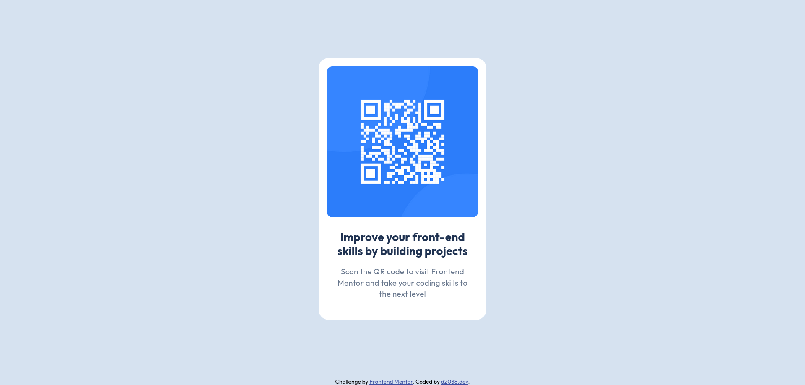

# Frontend Mentor - QR code component solution

This is a solution to the [QR code component challenge on Frontend Mentor](https://www.frontendmentor.io/challenges/qr-code-component-iux_sIO_H). Frontend Mentor challenges help you improve your coding skills by building realistic projects. 

## Table of contents

- [Overview](#overview)
  - [Screenshot](#screenshot)
  - [Links](#links)
- [My process](#my-process)
  - [Built with](#built-with)
  - [What I learned](#what-i-learned)
  - [Useful resources](#useful-resources)
- [Author](#author)

## Overview

### Screenshot



### Links

- Solution URL: [https://github.com/d2038-dev/fm-qr-code](https://github.com/d2038-dev/fm-qr-code)
- Live Site URL: [https://d2038-dev.github.io/fm-qr-code/](https://d2038-dev.github.io/fm-qr-code/)

## My process

### Built with

- HTML
- CSS
- Flexbox
- Mobile-first workflow

### What I learned

Learned to set body to full viewport height:

```css
body {
  min-height: 100vh;
}
```

and using flexbox to expand wrapper:

```css
body {
  display: flex;
  flex-direction: column;
}

.wrapper {
  flex: 1;
}
```

### Useful resources

- [A Modern CSS Reset](https://www.joshwcomeau.com/css/custom-css-reset/) - Utilized for CSS reset implementation.
- [Centering in CSS Guide](https://css-tricks.com/centering-css-complete-guide/) - Explored different CSS centering techniques.

## Author

- Github - [d2038.dev](https://github.com/d2038-dev)
- Frontend Mentor - [@d2038-dev](https://www.frontendmentor.io/profile/d2038-dev)
